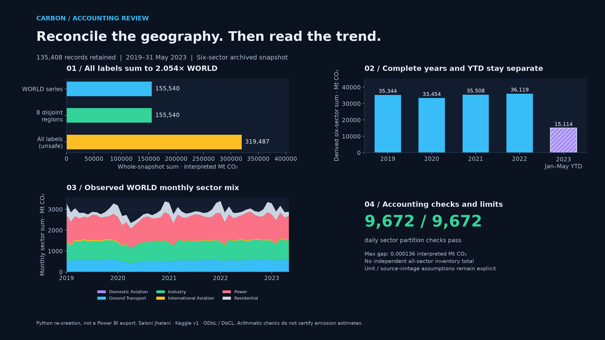
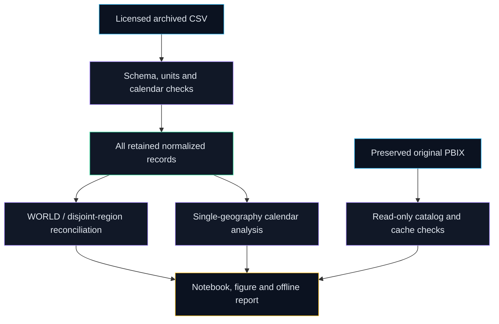

# Carbon Accounting Review

Reproducible emissions analytics that reconcile overlapping geographies and compare complete years with clearly labelled year-to-date observations.

[](https://github.com/Prajwal-Pratap-Yadav/Visualizing-Carbon-Footprints-Across-Sectors-Power-BI/actions)
[](LICENSE)
[](pyproject.toml)
[](CHANGELOG.md)



*Python re-creation, not a Power BI export. Fixed licensed snapshot; documented MtCO2 interpretation.* Open the [offline companion report](docs/assets/carbon-report.html) from a clone or downloaded evidence archive. Start with the [engineering case study](docs/CASE_STUDY.md) for the problem, intervention and measured outcome.

## Why this matters

- **Problem:** countries, a European composite, ROW and WORLD share one source field. An unrestricted sum double-counts geography coverage.
- **Approach:** retain every original record, make scope explicit, reconcile a disjoint partition to WORLD and enforce comparable calendar windows.
- **Outcome:** a reviewable accounting contract, generated visual report and original-model evidence, with source and scientific limits beside the results.

## Quickstart

Python 3.11 or 3.12, `make` and Git on Linux. The archived source is included; runtime accounting has no third-party dependencies or external data fetch.

```bash
git clone https://github.com/Prajwal-Pratap-Yadav/Visualizing-Carbon-Footprints-Across-Sectors-Power-BI.git
cd Visualizing-Carbon-Footprints-Across-Sectors-Power-BI && make setup
make run
```

The run writes retained normalized records, a WORLD slice, a nonoverlapping-region slice, every spatial residual and calendar analytics to `data/processed/`. Exit 0: spatial policy passes; 1: residual failure; 2: rejected input/policy. Inspect [reconciliation](reports/reconciliation.json) and [descriptive insights](docs/insights.md). The shipped HTML opens locally and needs no network resources. Source/developer requirements and actual run evidence are in [EVIDENCE](docs/EVIDENCE.md).

## Features

- Exact source-hash/schema/grain checks, UTC date validation, bounded decimal values and explicit country ISO3 versus aggregate IDs.
- All-row retention, exact MtCO2→tCO2 scaling with an interpretation flag, and independently checked WORLD/partition residuals.
- Complete-year YoY, sector shares, strict seven-calendar-day means, complete-endpoint CAGR and matched Jan–May YTD; zero-denominator results remain unavailable.
- Actual-data hero and offline report with one geography selector, full-year/YTD labels and a numeric table behind the monthly chart.
- Executed ordinary-Python notebook, generated dictionary, source receipt and read-only original Power Query/DAX/visual/cache catalog.
- Pinned/hash-locked tools, adversarial and end-to-end tests, independent raw-CSV checks, optional browser QA and attributed release packaging.

## Architecture



A dependency-free typed runtime separates extraction, scope policy, reconciliation, calendar analysis and export. Developer tools generate presentation evidence; a separate inspector decodes the unchanged original report. Proposed DAX is documented for a future companion model. See [architecture](docs/architecture.md) and [lineage](docs/lineage.md).

## Design decisions

| Decision | Alternatives rejected | Why | Trade-off |
|---|---|---|---|
| [Keep the fixed source and original bytes](docs/adr/001-retain-source.md) | Substitute revised current values | Exact historical reproduction and clear license/vintage evidence | Existing CSV is a documented 8.28 MB exception |
| [One geography; separate disjoint partition](docs/adr/002-safe-geography.md) | Unrestricted country/aggregate multiselect | Prevent overlapping coverage from inflating totals | Combined ad hoc totals require an explicit scope model |
| [Decimal accounting; complete calendar windows](docs/adr/003-calendar-and-decimals.md) | Unbounded floats; annualized 2023 | Preserve arithmetic and expose observed coverage | Presentation rounding differs from authoritative decimal exports |

## Results and limitations

| Result | Value | Provenance / meaning |
|---|---|---|
| Source records retained | **135,408 / 135,408** | ✅ Measured: `make run`, [profile](reports/reconciliation.json); 14 labels × 1,612 days × 6 sectors |
| Unsafe all-label sum / WORLD | **2.054055×** | ✅ Measured: whole-snapshot arithmetic; overlapping aggregates are not additional emissions |
| Independent day/sector spatial checks | **9,672 / 9,672 pass** | ✅ Measured: WORLD versus eight disjoint regions; declared symmetric rounding tolerance |
| Maximum absolute spatial residual | **0.000136 interpreted MtCO2** | ✅ Measured: full retained residual table; not scientific measurement accuracy |
| WORLD 2022 six-sector total / YoY | **36,119.462025 interpreted MtCO2 / +1.722092%** | ✅ Measured: complete 2022 versus complete 2021, [analysis](reports/analysis.json) |
| WORLD Jan–May 2023 total / matched YoY | **15,113.988959 interpreted MtCO2 / +0.341403%** | ✅ Measured: 151 observed days versus Jan–May 2022; never annualized |
| Original report inspection | **4 pages, 25 native visuals, 0 explicit measures** | ✅ Measured: read-only [catalog](reports/model/catalog.json); proposed companion DAX is uninstalled |

Commands, source commits, environment, dates and artifacts are in [EVIDENCE](docs/EVIDENCE.md). Each insight names an executed [notebook](notebooks/01_accounting.ipynb) cell; [run manifest](reports/run_manifest.json) records source/data/policy/output hashes. Original cached records and independent pandas arithmetic agree within explicit tolerances; this is **not validation against Power BI output**.

The six-sector total is derived; there is no independent all-sector inventory total. Immediate Kaggle provenance and licensing are byte-verified, while original primary release lineage and uploader-specific unit metadata remain qualified. Values are CO2, not CO2e; source scope, LULUCF, shipping and aviation allocation limits matter. No population/per-capita result, causal finding, current-inventory claim or scientific-accuracy certification follows. Desktop refresh/render and DAX evaluation remain manual. Read [DATA](docs/DATA.md), [methodology](docs/methodology.md) and [refresh guide](docs/refresh.md).

## Repo map

| Path | Purpose |
|---|---|
| `src/carbon_audit/` | Typed extraction, geography policy, reconciliation, calendar analytics and CLI |
| `data/raw/`, `data/source-receipt.json` | Byte-preserved licensed source and provenance |
| `configs/`, `tests/` | Strict accounting contract and meaningful failure-mode tests |
| `powerbi/original/`, `powerbi/companion/` | Original binary/history and proposed DAX review catalog |
| `notebooks/`, `reports/` | Actual stdout, deterministic profiles and environment evidence |
| `docs/`, `docs/assets/` | Methodology, decisions, case study and actual-data views |
| `scripts/`, `.github/` | Reproduction, independent checks, inspection, CI and guarded releases |

## Development

`make setup-dev` installs hash-locked developer tools and staged secret checks. Run `make lint typecheck test run reproduce docs build security`. `make setup-inspect inspect` uses a separate Python 3.12 read-only model environment. Optional `make setup-browser browser-test capture` installs locked Node tools and Chromium, checks the real offline report and captures actual companion views. Runtime quickstart needs none of those optional tools.

`make reproduce` generates every numerical/report artifact and executes the notebook as ordinary Python with actual stdout; it does not claim a Jupyter kernel session. The independent checker recomputes raw grain/export/spatial/annual/monthly/YTD/share arithmetic. `make clean` removes generated exports, local checks and build caches. See [CONTRIBUTING](CONTRIBUTING.md), [security](SECURITY.md) and [changelog](CHANGELOG.md).

## Roadmap

[Next verified companion (0.2.0)](https://github.com/Prajwal-Pratap-Yadav/Visualizing-Carbon-Footprints-Across-Sectors-Power-BI/milestone/1) tracks actual open work:

- [Validate DAX and export genuine Desktop pages #1](https://github.com/Prajwal-Pratap-Yadav/Visualizing-Carbon-Footprints-Across-Sectors-Power-BI/issues/1).
- [Clarify original units, primary vintage and transport allocation #2](https://github.com/Prajwal-Pratap-Yadav/Visualizing-Carbon-Footprints-Across-Sectors-Power-BI/issues/2).
- [Reviewed PBIP companion and scoped population-join proposal #3](https://github.com/Prajwal-Pratap-Yadav/Visualizing-Carbon-Footprints-Across-Sectors-Power-BI/issues/3).

## License, data and citation

Code and invented packaging fixture: [MIT](LICENSE). Real archived database and derived databases: **ODbL 1.0 / DbCL 1.0**, attributed to **Saloni Jhalani, CO2 Emissions by Sectors, Kaggle v1**; see [data reuse terms](data/LICENSE.md) and [source receipt](data/source-receipt.json). Original report/license bytes are preserved; embedded data retains its own terms. Figures/report attribute the source and are labelled Python re-creations.

Cite the software using [CITATION.cff](CITATION.cff), and separately cite the [immediate source](https://www.kaggle.com/datasets/saloni1712/co2-emissions) and referenced [Carbon Monitor methods](https://doi.org/10.1038/s41597-020-00708-7). That methods citation does not establish this upload's primary historical release lineage.
