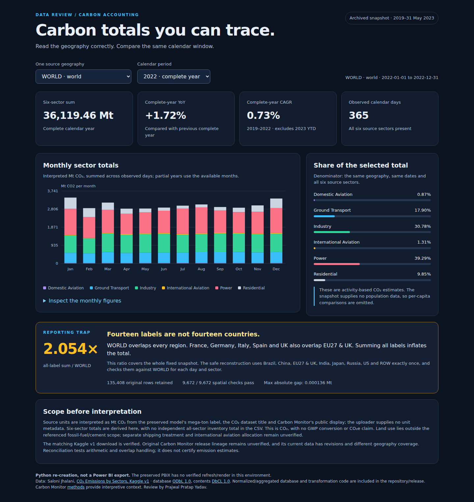

# Carbon Accounting Review — engineering case study

**A reproducible companion audit turns an archived emissions dashboard into a reviewable analytical project.** The central problem was scope: a field called `country` contained countries, a European composite, a residual region and WORLD. A plausible-looking total could therefore count the same coverage more than once.

## Intervention

Retain the original report and all 135,408 source records. Verify the immediate source and licensing by an exact public-archive byte match. Add explicit geography identities, bounded decimal extraction, an independent WORLD-versus-eight-region reconciliation and calendar-aware analytics. Present the results in a generated visual review and offline report whose filters select one geography and distinguish complete years from 2023 YTD.

## Observed result

| Finding | Evidence | Interpretation |
|---|---|---|
| Every label combined is 2.054055× WORLD | [Reconciliation](../reports/reconciliation.json) | A scope error, not additional emissions |
| 9,672 of 9,672 daily-sector checks pass | Same profile; full residual export | Internal spatial consistency within a declared rounding tolerance |
| 2022 WORLD six-sector sum is 36,119.462025 interpreted MtCO2 | [Analysis](../reports/analysis.json) | Derived archived total; no independent all-sector inventory supplied |
| Jan–May 2023 is 15,113.988959 interpreted MtCO2 | Same analysis; [notebook](../notebooks/01_accounting.ipynb) | 151 observed days, not an annual estimate |
| Original report bytes preserved | [Baseline hashes](../reports/baseline-files.json) | Companion improvements can be reviewed without rewriting historical evidence |

## Engineering judgment

The strongest result is the accounting contract, not a claim of scientific accuracy. Immediate uploader provenance is verified; primary release lineage and original unit metadata remain qualified. The source estimates do not support per-capita rankings, causal findings or a government-inventory endorsement. The original PBIX has been decoded read-only, with cached arithmetic cross-checks; Desktop refresh/render and the proposed DAX model are not validated outputs. [Evidence](EVIDENCE.md), [methodology](methodology.md) and [decisions](adr/002-safe-geography.md) document what a reviewer can reproduce and what remains manual.

## Inspect the delivered experience

The [offline HTML](assets/carbon-report.html) exposes the same decimal-backed totals, date-window choices, source attribution and accounting caveats. [YTD](assets/report-ytd.png) and [mobile](assets/report-mobile.png) captures demonstrate partial-year labels and responsive presentation. These are actual Chromium captures of the companion report, not Power BI exports; [receipt](../reports/browser/capture-manifest.json) records their source and hashes.
