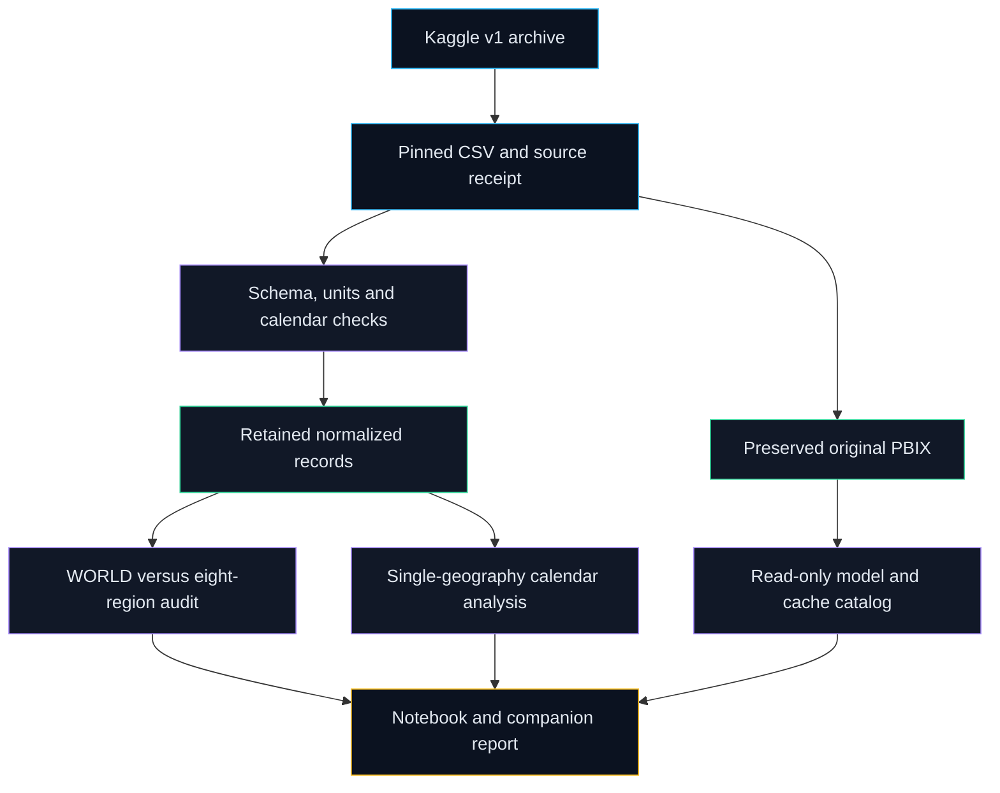

# Source and report lineage

The immediate source archive is verified by a byte match. Original PBIX and CSV are preserved independently of the companion calculation. No new measures or visuals are installed in that binary. [Original model catalog](../reports/model/catalog.json) records its expressions and visual bindings; [cached cross-checks](../reports/model/arithmetic-crosschecks.json) compare decoded records with the source. Generated dictionaries, profiles, notebook stdout, figure and self-contained HTML report retain source attribution. Each run records source Git SHA, worktree state, package versions and output hashes in [run_manifest.json](../reports/run_manifest.json).

The current primary-source comparison is a separate diagnostic, not an input substitution. The report uses the fixed archived source even when current values differ. Proposed companion DAX requires a separate reviewed model; Desktop refresh/render and DAX evaluation remain manual.
